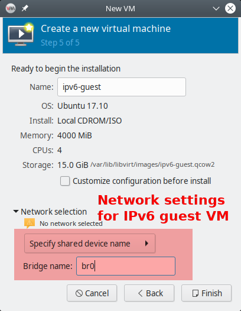

== Overview on virtual machines

At this moment, we have a fully operational IPv6 autoconfiguration environment.
Every modern operating system will configure itself and have full IPv6 connectivity.

Additionally, through the NAT64/DNS64 address translation layer, all the IPv6-only virtual machines will be able to access IPv4-only servers seamlessly and also without any additional configuration requirements.

=== Initializing a virtual machine

Installing a virtual machine might sound difficult to you if you have never done this before. In fact, it is not. After all, it is even simpler than the remote installation on a hosted system once you get used to it. On the physical machine, you are dependent on what the hosting provider offers as installation procedures. KVM offers you more or less a complete virtualized graphical console which allows to act just as you were sitting in front the (virtual) computer's monitor. This way, you can install whatever you like.

Furthermore, if you make a configuration mistake on the physical host, you might end with a broken machine. If this happens in a virtual machine, you have several ways to solve the problem: You can connect to the console and log in directly without network access. If the machine does not boot any more, you can even mount the virtual hard disk into the physical machine and try to fix. And if the machine is for any reason broken beyond repair, you can just throw it away and start over with a fresh installation.

I suggest to start with a throw-away virtual machine. It will not contain any "real" services but only show any remaining problems in the setup. Further, it allows to test and learn the whole process of installing a virtual machine in the setup.

* Copy the installation ISO image for the system to install onto the host.
* Connect to the KVM system using `virt-manager`. Of course, you might also use another client, but I find this rather easy.
* Use the ssh connection of the normal user created on the host.
* Start the host creation.

From hereon, things become rather standard. We're now in the process of installing a guest system in a KVM guest. My best practices are these:

* Assign as many CPUs to the virtual machine as the hardware has. Only if you suspect the virtual machine to grab too much resources, reduce the CPU number.
* Use cow2 image file for the virtual harddisk. It is the most flexible way once it comes to migrating the virtual machine and today's file systems can cope with the double indirection quite well.
* Give the virtual machine definition the same name the system will later have.

The one interesting point is the network configuration at the very end of the definition process. Here, enter the "Network selection" before creating the machine. Select "Name of common device" and give the name of bridge explicitly. Here it is `br0`.

.Select the correct network device

If you are ready, press "Create" and summon your first virtual system.

=== DNS and auto-boot

To work with the long IPv6 addresses conveniently, DNS is almost mandatory. You should enter the virtual machine now into the domain.

* Find the virtual machine's IP address. On Linux systems, `ip a` does the job. You may also derive it manually from the virtual machine's MAC address (as SLAAC uses it, too).
* Create an entry in the DNS zone of the system. Note that you only enter a `AAAA` record, _not_ an old-fashioned `A` record for an IPv4 address. The system just has no IPv4 address...
* In my opinion, it makes also sense to _always_ create a reverse IP entry for IPv6 hosts. If for any reason your DNS AAAA entry vanishes, you still have the reverse IP entry which assigns name and IP address. Reverse IP entries are always managed in the DNS realm of the IP network owner. In my case, they are edited in Hetzner's robot interface.

The SLAAC mechanism derives the IP address from the MAC address of the virtual machine. So, it will be static even though it has nowhere been configured explicitly.

If you want your virtual machine to be started automatically if the physical host starts up, you have to set the corresponding flag in the KVM configuration. In `virt-manager`, you find it in the "Boot options" for the virtual machine.

=== Adding an IPv4 address to the virtual machine

The first and foremost advice for this topic: *Don't do it!*

Your virtual machine is fully connected to the internet any can be reached from anywhere and for any service.
The only restriction is that a connecting party must use IPv6.
Most systems, however, are connected by IPv6 these days.

Even if the virtual hosts a service which must also be accessible by IPv4-only clients, a direct IPv4 connection for the virtual machine is not mandatory.
Especially for HTTP-based services, we will configure a reverse proxying scheme on the physical host which allows transparent connections to IPv6-only web servers on the virtual machines for IPv4-only clients.
So, only configure a direct IPv4 connection into a virtual machine if it runs a service which _requires_ it.

In the provider-based scenarios, the provider has to assign an additional IPv4 address to the physical host. Then, the physical host must be configured in a way that it passes the IPv4 address to the virtual machine. Finally, the operating system on the virtual machine must handle these connections. Do like this:

Obtain an additional IPv4 address for your server from your hoster.
If you already have a network of them assigned to your server, you can use one of those, of course.

.Provider-dependent setup
IMPORTANT: The actual setup depends on the network scheme of your provider. Hetzner implements a direct peer-to-peer routing of IPv4 addresses. We continue based on this setup.

==== The physical host

If the physical host is configured *with Netplan*, add the route to the virtual guest explicitly:

.Additional IPv4 address in Netplan-based configuration on the physical host
----
root@merlin ~ # cat /etc/netplan/01-netcfg.yaml 
network:
  [...]
  bridges:
    br0:
      [...]
      addresses:
        - 241.61.86.241/32
        - 2a01:4f8:1:3::2/64
      routes:
        [...]
        - to: 241.61.86.104/32  # <-- IPv4 address of the virtual machine
          via: 241.61.86.241  # <-- IPv4 address of the host
[...]
----

After adding these entries, use `netplan try` to test the changes. If the configuration still works (countdown may stall for 4 to 5 seconds), press Enter and make the changes permanent.

.More information needed
NOTE: There is not that much information about Netplan-based network configuration stuff in the internet, unfortunately. Let me know if this configuration did not work for you.

On a physical host *with systemd-networkd* setup, add an entry to the bridge device configuration. In the description above, this is the file `/etc/systemd/network/21-br0-conf.network`. Add the following lines:

.Additional IPv4 address in systemd-networkd's br0 configuration
----
[Address]
Address=<IPv4 address of the host>
Peer=<IPv4 address for the virtual machine>
----

There are two `[Address]` entries now in this file which both have the same `Address` but different `Peer` entries. That's intentional.

==== The virtual machine

On the virtual machine, add the IPv4 address to the Netplan configuration, usually in `/etc/netplan/01-netcfg.yaml`. It reads completely like this:

.Netplan configuration on the virtual machine with additional IPv4 connectivity
----
network:
  version: 2
  renderer: networkd
  ethernets:
    ens3:
      dhcp6: yes
      addresses: [ IPv4 address for the virtual machine/32 ]
      routes:
        - to: 0.0.0.0/0
          via: IPv4 address OF THE PHYSICAL HOST
          on-link: true
----
      
.The physical host is the IPv4 default route!
CAUTION: Note that - at least in the Hetzner network - it is crucial that you declare _the physical host_ as the default route for IPv4 traffic from the virtual machines! If you set the gateway given by Hetzner, traffic is not routed. In this case, you can reach the guest from the host but from nowhere else via IPv4.

On the virtual machine, you can apply your changes with `netplan try` and pressing Enter, too. You can check the IPv4 routes after that which should only show one entry:

.IPv4 routing table on the virtual machine
----
# ip -4 r
default via <IPv4 address of physical host> dev ens3 proto static onlink 
----

.Information on systemd-networkd-based setups missing
NOTE: I have not configured systemd-networkd-based virtual machines so far, so I do not know how to set them up correctly. But it should be easy as only a static address and gateway entry is needed.

Depending on the installation routine of the operating system, there could be another thing to change. Check whether your `/etc/hosts` contains a line

.Wrong line in /etc/hosts
----
127.0.1.1 <name of virtual machine>
----

This might have been added during installation as your system had no IPv4 connectivity at all at that stage. Now that you have full IPv4 connectivity, this can be misleading to some systems. Exchange it with

.Correct line in /etc/hosts
----
<IPv4 address of virtual machine> <name of virtual machine> <name of virtual machine>.<domain of virtual machine>
----

e.g.

----
1.2.3.4 virthost virthost.example.org
----

Finally, *add DNS and reverse DNS entries* for the IPv4 address for the virtual machine.
Now, it is directly accessible by both IPv4 and IPv6 connections.

==== Name service on IPv4-enhanced virtual machines.

If you follow this guide, an IPv4-enhanced virtual machine will still connect to IPv4-only servers via IPv6! The reason is the DNS64-enhanced name server. It will deliver IPv6 addresses for such servers and the outgoing connection will be established through the NAT64 gateway.

Normally, this has no drawbacks. We install the IPv4 connectivity only for _clients_ which need to connect to a service on the virtual machine via IPv4 - and this is the case with the configuration described above. Remember that the whole NAT64/DNS64 magic happens at the DNS layer. My advice is to generally _not_ configure a special DNS server for virtual guests with direct IPv4 connectivity but use the DNS64-enhanced system from the IPv6 auto configuration.

There are exceptions to this rule, however. The most remarkable one is if the virtual machine becomes an e-mail server. In this case, it _must_ establish outgoing connections to IPv4 servers via IPv4 or otherwise its connections are blocked. We'll see how to handle this in the respective section.

==== About IPv4 auto-configuration

This setup assigns IPv4 addresses statically. One could argue that the usual auto configuration setups like DHCP and MAC-address-based IP address assignment should be used. This would, of course, be possible.

I opted against such setups as I don't think, they are necessary. The setup described here is based on IPv6 and it can be run as IPv6-only setup. For IPv6, we have complete connectivity and auto-configuration - which is even completely static so no configuration entries are needed for individual machines.

The complexity of IPv4 setups comes from the workarounds established against its limitations, most notably to notorious NAT setups and addresses from some local address ranges.

_All this is not needed any more with IPv6!_

My strong advise is: Use IPv6 as the standard protocol for everything you do on all your systems. Take IPv4 only as bridge technology for the legacy parts of the internet. Only assign _one single_ IPv4 address to your virtual machines if you absolutely must.

And for such a setup, you do not need fancy autoconfiguration. Just enter the address on the physical host and the virtual machine and you're done. If somewhen in the future, IPv4 connectivity is not needed any more, throw it away.

It's much simpler and less error-prone than administrating additional DHCP servers and configuration files.
