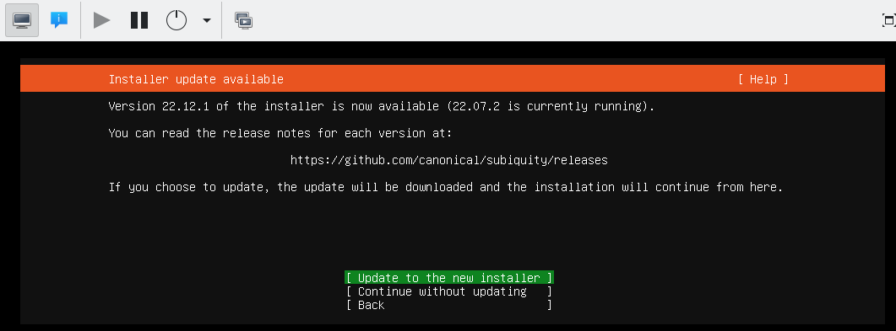
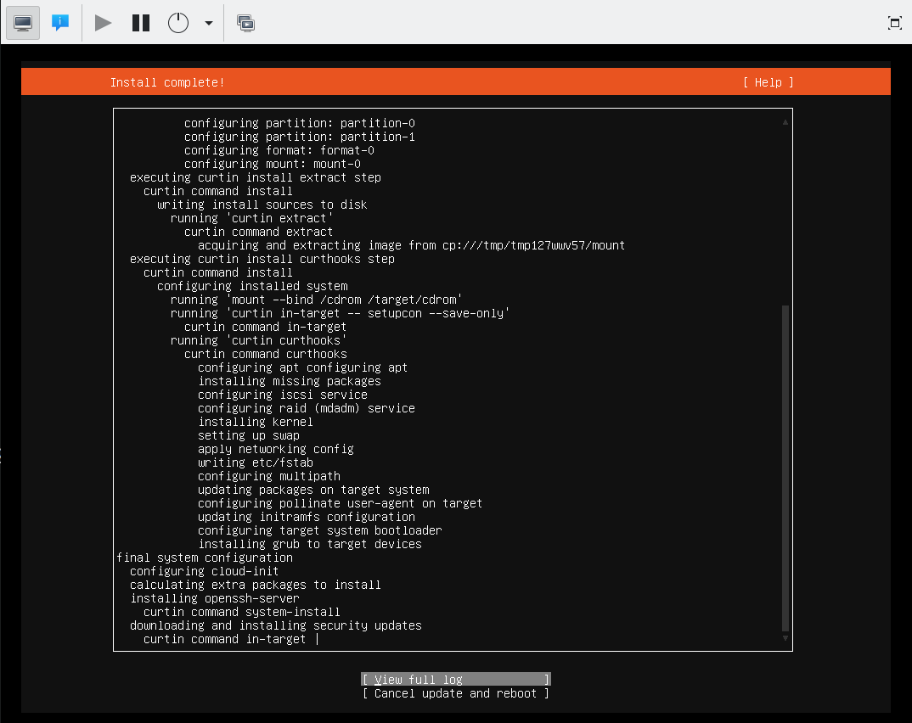
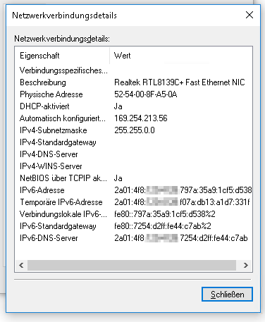

== Operating-systems in the virtual machines

You can install any operating system which is capable of running in a virtualized setup. Of course, it _must_ be able to use IPv6 and it _should_ be able to auto-configure its network settings via SLAAC. Fortunately, all modern operating systems support such setups nowadays.

One very nice thing about virtualisation is that you can install the operating system in the virtual machine _just as if you sat in front of the machine's console_. KVM virtualisation and virt-manager forward a (virtual) keyboard, mouse and screen so that you can interact with the system even when it has no internet connection - which is the usual situation during the initial installation of the operating system. This makes you completely independent of the hosting provider and allows you to install _any_ operating system in your virtual machine (as long as it supports IPv6 and SLAAC).

[[ssec-vm-ubuntu-2204]]
=== Ubuntu 22.04

In this section, I give some advises for the Ubuntu 22.04 installer. Note that Ubuntu has changed the installer completely compared to Ubuntu 20.04 so the menu is much different.

* Select the language for the installed system. I often go for "English" to have error messages and general dialogs in the most common locale. Note that you can change the main locale settings even after installation using `dpkg-reconfigure locales`.
* The installer might offer a newer version of itself. I suggest to go for it. The following documentation is for version 22.12.1 of the installer.
+
.Subiquity in-installation upgrade

+
Note that upgrading the installer at this point already uses the internet connection of the virtual machine. And as the download server is an IPv4-only-connected Github system, this even includes NAT64 and DNS64. If this update succeeds, you can assume radvd, bind, tayga, and the network bridge to work correctly.
* The choice of the keyboard should reflect the actual physical keyboard you are typing on.
* I use the "normal" Ubuntu Server, not the minimized version, as I intend to login on my virtual machines.
* Installation of SLAAC-driven IPv6 networks cannot be selected explicitly with the current version of Subiquity.
I suggest not to change the settings here, so to keep IPv4 to "DHCP" and IPv6 to "disabled". IPv6 SLAAC auto-negotiation will be performed nevertheless. Note that you must not disable _both_ protocols as the whole network interface will be disabled then.
* No proxy needed.
* In Hetzner's network, use `http://mirror.hetzner.de/ubuntu/packages` as download server address.
* You can use the entire disk as installation target, and I suggest to disable the LVM feature here. Note that if you configured your physical host with a (software) RAID setup, the virtual machine will benefit from this, too, as its (virtual) harddisk is actually a file on this RAID.
* After installation start and selection of a user name, the installer asks if it should install an ssh server. I stongly suggest to do so! Without ssh, you can only access the system via the virtual console - and that just does not make too much fun.
* In the installation progress screen, you can switch to "View full log" at the bottom of the screen to see what's happening on the virtual machine. Especially "downloading and installing security updates" might take some time, depending on the age of your installation image.
+
.Installation of security updates in Subiquity

+
Wait for this step to finish, otherwise your installation will not be complete!

If you install the system from the "Create virtual machine" screen, the install ISO image will be removed from the boot device sequence of the virtual machine automatically. However, if you installed the system into an already existing virtual machine, you have to do that yourself. This change will only be applied if you turn off the virtual machine completely and restart it from scratch (e.g. in virt-manager). _Rebooting the operating system within the virtual machine is not enough!_

Subiquity writes an extremly stripped down Netplan configuration into `/etc/netplan/00-installer-config.yaml`. It contains no information about IPv6 autoconfiguration; it seems that SLAAC is always performed, even if not explicitly mentioned. If you left the default network settings as they were, however, there is a line enabling DHCP for IPv4. I suggest to disable this by setting it to `false`. Note that you should _not_ remove all lines completely as there must be at least one entry for an active network device in the Netplan configuration.

.Suggested Netplan configuration in a Ubuntu 22.04 virtual machine
----
# 'subiquity' network config, changed for IPv6-only hosts
network:
  version: 2
  ethernets:
    enp1s0:
      dhcp4: false
----

[[ssec-vm-nixos-2211]]
=== NixOS 22.11

.Heavy under construction
WARNING: NixOS instructions have been added only recently. They are far from finished and even more subject to change than the rest of this document!

NixOS follows a unique declarative configuration style.
The whole system is configured by a static description which is rolled out by "nix", a kind of preprocessor and package manager.
NixOS offers capabilities as atomic updates and per-package dependency chains,
i.e. it allows to have multiple versions of libraries and even programms installed in parallel.

==== Network configuration

NixOS networking can be configured like this to work with the IPv6-first setup:

.Suggested /etc/nixos/network.nix configuration file for a NixOS 22.11 virtual machine
----
{ config, pkgs, ... }:

let
  device = "enp1s0"; # <- Set this to the actual network device
in {
  networking.tempAddresses = "disabled";
  systemd.network = {
    enable = true;
    wait-online = {
      anyInterface = true;
      extraArgs = [ "--ipv6" "--interface=${device}" ];
      timeout=3;
    };
    networks.${device} = {
      enable = true;
      DHCP="ipv6";
      ipv6AcceptRAConfig = {
        DHCPv6Client = "always";
        UseDNS = true;
      };
    };
  };
}
----

You have to change the `device` setting at the beginning to name the actual device in your system.

Note that the `systemd.network.wait-online` service is notoriously problematic.
I tamed its unwillingness to detect successful network configuration by setting

* `anyInterface` to true,
* explicitly constraining it to IPv6 and the specific interface with the `extraArgs`
* decreasing its timeout vastly.

Almost surely this can be simplified considerably. It has to be evaluated further.

After all, include the `/etc/nixos/network.nix` file into the main configuration in `/etc/nixos/configuration.nix`:

.Inclusion of network.nix in /etc/nixos/configuration.nix
----
{ config, pkgs, ... }:

{
  imports =
    [
      [...]
      ./network.nix
      [...]
    ];

  [...]
}
----

With this, the interface should be initialized correctly with the IPv6 address derived from the virtual MAC address:

.Network configuration on a NixOS virtual machine
----
# ip a
[...]
2: enp1s0: <BROADCAST,MULTICAST,UP,LOWER_UP> mtu 1500 qdisc fq_codel state UP group default qlen 1000
    link/ether 52:54:00:ba:b4:bf brd ff:ff:ff:ff:ff:ff
    inet 169.254.132.92/16 brd 169.254.255.255 scope global noprefixroute enp1s0
       valid_lft forever preferred_lft forever
    inet6 2a01:4f8:1:3:5054:ff:feba:b4bf/64 scope global mngtmpaddr noprefixroute
       valid_lft forever preferred_lft 14249sec
    inet6 fe80::5054:ff:feba:b4bf/64 scope link
       valid_lft forever preferred_lft forever
----

Note that change to the network configuration are applied by `nixos-rebuild switch` as given.
This could lead, however, to a connection loss if the configuration changes "too much".
You should consider applying these changes via a console connection to the virtual machine.

==== Anything else

For the rest, you can follow the standard https://nixos.org/manual/nixos/stable/index.html#sec-installation-manual[NixOS manual install instructions]. Some notes:

* Use the minimal ISO image without graphical installer at the bottom of the https://nixos.org/download.html#nixos-iso[NixOS download page]. Command line rulz!
* There should be no need to configure the installation network manually. The NixOS install environment works nicely together with our IPv6-first setup.
* KVM/QEMU environments do not offer (U)EFI, so follow the BIOS/MBR-based partitioning instructions.
* The suggested partition scheme with one big partition for all actually makes sense.
* To shutdown the system, use the `poweroff` command. `halt` will not shutdown the QEMU environment leaving the virtual machine in limbo.
* NixOS boots and reboots really fast!

=== Ubuntu 20.04

For Ubuntu 20.04, I advise these steps:

* Install by simply pressing the "Install" button. I never needed any additional kernel parameters.
* Select correct keyboard or it will drive you nuts.
* Network autodetection will idle around when looking for the non-existing DHCP server. Keep calm. Apart from that, it will simply setup everything correctly.
* Enter the hostname, preferrably the same as the name of the virtual machine to keep it simple...
* Check whether you provider has their own mirror for the installation server. Hetzner has, therefore you can save download time:
** Go to top of mirror list and press `enter information manually`
** For Hetzner: `mirror.hetzner.de`. This server also works also with IPv6. But even IPv4 servers would be possible due to our NAT64/DNS64 setup.
** Set directory for the Hetzner server to `/ubuntu/packages/`
* You do not need a HTTP proxy.
* Install should start.
* I suggest to not partition the virtual hard disk in any way. It is not needed.
* Everything else is as usual. In the software selection, you should at least select the "OpenSSH server" so that you can log into the system after installation.

As this is Ubuntu 20.04, this machine uses netplan for network configuration. It has a very simple definition file in `/etc/netplan/01-netcfg.yaml`:

.Netplan configuration in a Ubuntu 20.04 virtual machine
----
# This file describes the network interfaces available on your system
# For more information, see netplan(5).
network:
  version: 2
  renderer: networkd
  ethernets:
    ens3:
      dhcp6: yes
----

Netplan summarizes router advertisement in the "dhcp6" statement. You do not need to change anything here.

Note that after (re-)booting the virtual machine, it may take some seconds until it has configured its network interface. Once it has done so, everything should work without problems.

Check if you have the <<sec-network-delay-systemd,network setup delay problem>> after reboots and fix them as described in the referenced section.

=== Ubuntu 18.04

Ubuntu 18.04 is installed exactly the same way as Ubuntu 20.04.

=== Windows 10

Windows "just works" when installed in an IPv6-only virtual machine.
It takes all the advertisements from `radvd` and configures its network appropriately.
The result is a Windows which has no IPv4 network aprt from the auto-configured one.

.Windows 10 with IPv6-only connectivity

