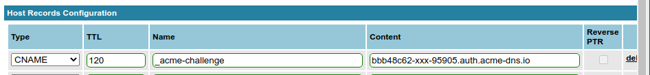

== SSL certificates with Let's Encrypt

.This chapter is not polished so far
WARNING: This chapter still work at progress at some points.
While the overall scheme works reliably, there are still rough edges.
As SSL connections are crucial for all other services and Let's encrypt is a very good source for them, I released this guide nevertheless.
Feel free to use other schemes or resources for your certificates or help increasing the quality of this chapter.

Today's internet requires encrypted connections for any serious web service.
Encrypted connections require certified encryption keys.
Such certificates must be issued by a trusted certificate provider.
"Let's encrypt" is such a provider which grants the certificates for free.

=== The basic idea

Lets recap shortly how SSL works:

* You have a _secret key_ on your (web) server which to setup encrypted connections with clients.

* You have a _certificate_ from a 3rd party which confirms that this key is actually yours and which contains information a client needs to encrypt messages your secret key can decrypt (and vice versa).

* You send that certificate to a client which connects to you.

* The client evaluates the certificate to gain information about the key to use and to read the confirmation that the information is valid.

* Therefore, the client also must trust the 3rd party which certified the key above.

The mentioned 3rd party is the _certification authority_ (CA).
To issue a valid certificate, it must answer two questions positively:

. Is the key really your key?
This problem is solved cryptographically by so-called "certificate signing requests (CSRs)".
They guarantee cryptographically that the issued certificate can only be used with the key it is created for.

. Is it really you?
For long time, this was the way more difficult problem as there were no simple technical ways to determine that someone is really the person they claim.

Let's encrypt, however, uses a completely automatable workflow which is based on so-called challenges. The protocol and scheme are called "ACME" and work this way:

. You: Hey, Let's encrypt, please certify my key for example.org.

. Let's encrypt: Ok, to prove that you have example.org under your control, perform a challenge. Only someone with sufficient rights can do it and that I can check it afterwards.

. You: <Perform the challenge> Done!

. Let's encrypt: <Check the challenge> Great. Here's your certificate

. You: Thanks. <Copy key and certificate where they are needed>

=== Site-specific certificates and HTTP-based challenge

There are different types of certificates.
First, you can certify a key for only one special server name, e.g. "www.example.org";
then, only a service which uses exactly this name can use the certificate.
This is the type of certificate you read most about when it comes to Let's Encrypt.
Its challenge is rather simple:

. You: Hey, Let's encrypt, please certify my key for www.example.org.

. Let's encrypt: Sure. Please put a file `/some-path/<unpredictable random name>` on `www.example.org`.

. You: _(Creates the file)_ Done!

. Let's encrypt: _(Connects to `www.example.org` and GETs `/some-path/<unpredictable random name`)_ Found it! Great. Here's your certificate.

. You: Thanks. _(Copies key and certificate into web server's SSL key store)_

The very nice thing about this scheme is that the Let's-Encrypt server, the Let's-Encrypt client `certbot` and your web server can handle out this all on their own.
`certbot` knows how to configure a local Apache so that it serves the file which the Let's Encrypt server wants to see.
There are even web servers like https://caddyserver.com/[Caddy] which have this scheme already built-in.

However, for the mixed IPv4/IPv6 setups, this scheme has some shortcomings.
It can only be performed on the virtual machine, as only there the web server can change the contents it serves in accordance with the Let's encrypt certificate request tool.
While this would work consistently as Let's encrypt explains on https://letsencrypt.org/docs/ipv6-support/[], the key has to be copied to the IPv4 proxy server.
Otherwise, encrypted IPv4 connections are not possible.
If for any reason the IPv6 web server is unresponsive and Let's encrypt falls back to IPv4, the challenge fails and the certificate is not issued.

All in all, I decided against this scheme for all my domains.

=== DNS-based challenge and wildcard certificates

In my setup, I use a certificate for _any_ name below `example.org`.
Such a _wildcard certificate_ is expressed as `*.example.org` and allows to use the certified key for everything below the domain name, e.g. `www.example.org`, `smtp.example.org`, `imap.example.org` and anything else.

For such wildcard certificates, the HTTP-based challenge is not sufficient.
You have to prove that you not only control _one name_ in the domain, but the _complete_ domain.
Fortunately, there is a way to automate even this: The DNS entries of the domain.

.DNS-based challenge for non-wildcard certificates
NOTE: Of course, you can use DNS-based challenges also for certificates with specific names only.
As you'll see, our keys will actually be certified for `*.example.com` _and_ `example.com`.
Wildcard certificates simplify the management a bit as they are immediately useable for any new names in a domain.

Obtaining a certificate for `*.example.org` works with the following dialog:

. You: Hello Let's encrypt, please certify my key for `*.example.org`.

. Let's Encrypt: Ok, please set the String "<long random String>" as TXT record in the DNS domain as `_acme-challenge.example.org`

. You: _(Changes the DNS entries)_ Here you are!

. Let's Encrypt: _(Performs DNS query)_ Great. Here's your certificate.

. You: Thanks. _(Copies key and certificate where they are needed)_

This works perfectly. 
There is one tiny problem:
The DNS entries have to be changed.
And there is no general scheme how to automate this with the usual DNS server system.
Many providers do only offer a web-based interface for editing or have a proprietary interface for changes to the DNS entries.
And such interfaces tend to give very much power to the caller.

=== DNS rerouting

Thankfully, there is a solution even for this problem:
A special tiny DNS server which is tightly bound to the whole challenge process and can be programmed to return the required challenge.
Such a server exists, it is the "ACME-DNS" server on https://github.com/joohoi/acme-dns[].

But this server runs on its own name which might even be in a totally different domain, e.g. `acme-dns.beispiel.de`.

And here comes the final piece:
The domain `example.org` gets a _static_ `CNAME` entry pointing `_acme-challenge.example.com` to a DNS `TXT` record in `acme-dns.beispiel.de`.
And _that_ entry is the required `TXT` record Let's Encrypt's certification server checks for the certificate validation.

The complete scheme with ACME, ACME-DNS and all the routing steps becomes rather elaborate:

.Certificate validation with Let's Encrypt, ACME, and ACME-DNS
[plantuml,format="svg",align="center"]
....
@startuml

hide footbox
participant "You (certbot)" as you
participant "DNS server\nfor example.org" as dns
participant "ACME-DNS server\nbelow beispiel.de" as acmedns
participant "Let's Encrypt's\nACME server" as le

== Registration with ACME-DNS server (only once) ==

you -> acmedns : Give me an account
acmedns -> you : Your entry is 6a28...4356.acme-dns.beispiel.de
you -> you : Save entry (and login credentials)
you -> dns : Set _acme-challenge.example.com\nCNAME 6a28....4356.acme-dns.beispiel.de.

== Obtain certificate from Let's encrypt (repeatedly) ==

you -> le : Please certify *.example.com
le -> you : Put "a457e...29" as TXT value into _acme-challenge.example.com
you -> acmedns : Put "a457e...29" as TXT value\ninto 6a28....4356.acme-dns.beispiel.de
acmedns -> you : Did it.
you -> le : It's there!
le -> dns : Give me record for _acme-challenge.example.com
dns -> le : It's a CNAME pointing to 6a28....4356.acme-dns.beispiel.de
le -> acmedns : Give me record for\n6a28....4356.acme-dns.beispiel.de
acmedns -> le : It's a TXT saying "a457e...29"
le -> le : Check that\nrecord content\nis correct.
le -> you : Ok, challenge passed. Here is your certificate.

@enduml
....

This scheme finally allows to automatically obtain and manage Let's-Encrypt-certified SSL wild card keys.
And full automatism is important for the whole Let's Encrypt scheme as the issued certificates only have rather short validity time ranges:
They are only valid for 90 days and can be renewed from day 60 of their validity on.
So, each certificate is renewed four to six times per year!

Especially when the number of certificates becomes larger, a manual process is really, really tedious.

=== Set up the whole process

Time to bring things together.
We setup the following scheme:

* One system is responsible for gathering and renewing the certificates from Let's Encrypt.
* The whole key set is copied to all virtual machines and the physical host so that all web servers can access them.

In my original installation, I chose the physical host as the hub for this scheme.
While there is nothing wrong with that technically, it contradicts the rule not to run any unnecessary services at the physical host.

However you do it, first thing you need is the certificate robot `certbot`. In all Ubuntu versions covered here, the included one is sufficient, so installation is as simple as `apt install certbot`.

.About standards and implementations
NOTE: Technically, it is not 100% correct to say you need "certbot" to communicate with "Let's encrypt".
Both are implementations of a vendor-neutral standard, so it would be more precise to say you need a "client" to an "ACMEv2 server" where ACME is the acronyme of "Automatic Certificate Management Environment".
As this guide uses Let's Encrypt and certbot, I stick with these terms.

For the ACME-DNS part, you need an ACME-DNS server.
For the moment, I decided to go with the public service offered by `acme-dns.io`.
As its administrators say, this has security implications:
You use an external service in the signing process of your SSL certificates.
Wrong-doers could tamper your domain or get valid certificates for your domains.
However, as we see, you'll restrict access to your data to your own server, you are the only one who can change the crucial CNAME entry in your domain and you have an unpredictable account name on the ACME-DNS server.
As long as you trust the server provider, this all seems secure enough to me.

It is absolutely possible and even encouraged by their makers to setup your own ACME-DNS instance, and as the server is a more or less self-contained Go binary, it seems to be not overly complicated.
However, this has to be elaborated further.

Finally, you need the ACME-DNS client.
It is a short Python program.
Download it into `/etc/acme-dns` from its source on github:

.Get ACME-DNS
----
# mkdir /etc/acme-dns
# curl -o /etc/acme-dns/acme-dns-auth.py \
    https://raw.githubusercontent.com/joohoi/acme-dns-certbot-joohoi/master/acme-dns-auth.py
----

Load the file into and editor end edit the configuration at top of the file:

----
ACMEDNS_URL = "https://auth.acme-dns.io" # <1>
STORAGE_PATH = "/etc/acme-dns/acmedns.json" # <2>
ALLOW_FROM = ["<IPv4 address of physical host/32", "IPv6 address of physical host/128"] # <3>
FORCE_REGISTER = False # <4>
----
<1> This is the URL of the ACME-DNS server.
The default setting is the public service from acme-dns.
<2> The ACME-DNS client needs to store some information locally.
This setting lets it store its information also in the `/etc/acme-dns` directory.
<3> During account generation on the server, the client can restrict access to this account to certain source addresses.
Setting this to the IP addresses of the machine running the registration process increases security.
<4> The client program will register an account at the ACME-DNS server on first access.
If that account should be overwritten somewhen in the future, this variable must be set _once_ to True when running the program.
Normally, it should always be False.

Now you can generate key and certificate for your first domain. Run certbot on a domain to be secured with SSL _once manually_:

.First invocation of certbot on a domain
----
certbot -d example.com -d "*.example.com" \ # <1>
        --server https://acme-v02.api.letsencrypt.org/directory \ # <2>
        --preferred-challenges dns \ # <3>
        --manual # <4>
        --manual-auth-hook /etc/acme-dns/acme-dns-auth.py \ # <5>
        --debug-challenges \ # <6>
        certonly # <7>
----
<1> You request a certificate for `example.com` and `*.example.com` as the wildcard version does not match the domain-only server name.
<2> The ACME server must be capable of ACMEv2 as ACMEv1 does not know about DNS-based challenges.
<3> We use the DNS-based challenge.
<4> The challenge is performed "manually", i.e. not by one of the methods incorporated into certbot.
<5> However, this "manual" method uses the acme-dns client as hook for the authentication step, so after all it can be performed without interaction.
<6> In this call, however, we want `certbot` to stop before checking the challenge, because we have to setup the CNAME entry in the `example.com` domain.
<7> Finally the `certbot` operation: Issue a certificate.

Executing this call halts just before Certbot checks the certificate.
Instead, it prints the required CNAME for the domain.
So, now you have to edit your domain data and add this CNAME.

.DNS entry for the ACME-DNS CNAME in NamedManager

After the entry has been added and spread through the DNS, let certbot continue.

Only at this first certification process, manual interaction is needed. After that, `certbot` can, together with `acme-dns-auth.py`, handle the whole process automatically. You can see the setup in `/etc/letsencrypt/renewal/example.com.conf`.

For the process of certification that means: Put a call to `certbot renew` into the weekly cronjobs on the machine _and forget about it_.

Certbot puts the currently valid keys certificates for a domain into a directory `/etc/letsencrypt/live/<domain>`. Just use the files in that directory for Apache, Dovecot, Postfix and whatever.

=== Copy files to virtual machines

My suggestion is to run Certbot in a centralized way on one machine (in my current setup: the physical host) and copy _the complete directory with certbot's keys and certificates_ onto all machines which need one of the certificates.

Note that you need the certificates for all your web servers not only on the virtual machine where the web site runs, but also on the physical host which is responsible for the incoming IPv4 connections to the site.
It helps to prevent errors if you just copy the complete data set onto all machines at the same place.

So, just copy the `/etc/letsencrypt` directory to all virtual machines, do not install `certbot` there.

=== Planned extensions and corrections

From all services described in this guide, the Let's Encrypt setup is the least consolidated one.
There are some elements missing to make it really polished:

* `certbot` should run on a dedicated virtual machine and not on the physical host.
Implementing it this way was mainly due to me experimenting with the whole setup.

* ACME-DNS should use its own server. I would place it on the same virtual machine where `certbot` runs.
This way, that special DNS server would only be accessible via IPv6, but the docs say, this is no problem any more in the 2020s.

* The copying process must be enhanced.
Currently, `certbot` is run by root which is not the best idea of all.
There should be a dedicated `certbot` account which runs Certbot and is allowed to copy Certbot's directory to the other machines.

* Some mechanism must restart the services after the new certificates have been rolled out.
Currently, the certificate renewal happens somewhen between 30 and 22 days before the old certificate expires.
Often, automatic updates (and reboots) restart the Apache or the e-mail services in time.
This is not guaranteed, however.

Taking all this into consideration, this section of this guide is the clearest candidate for a larger rewrite.
